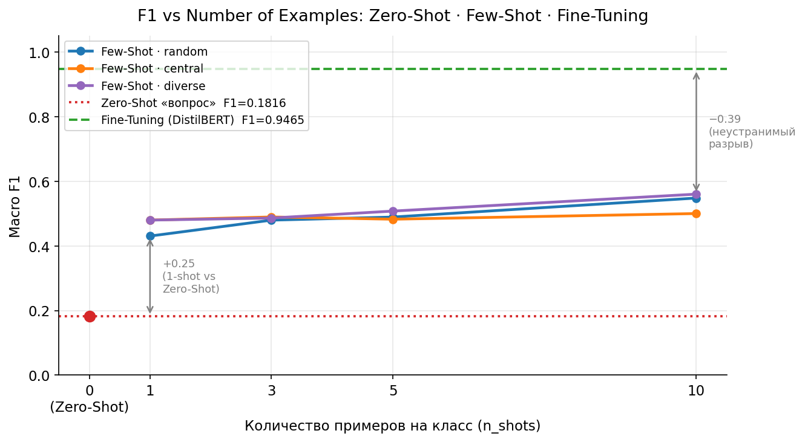

# Intent Classification: Few-Shot & Zero-Shot vs Fine-Tuning

Дипломная работа: сравнительный анализ подходов к классификации интентов на датасете CLINC150.

---

## Постановка задачи

Классификация интентов (intent classification) — ключевая задача в диалоговых системах и голосовых ассистентах. Модель должна определить намерение пользователя по его текстовому запросу.

**Датасет:** [CLINC150](https://github.com/clinc/oos-eval) — 150 классов интентов + `oos`, 23k примеров.

### Исследовательские вопросы

1. Насколько Zero-Shot уступает Fine-Tuning на простых и сложных интентах?
2. Сколько примеров нужно Few-Shot, чтобы догнать Fine-Tuning?
3. Какой подход оптимален с учётом затрат на разметку данных?

---

## Гипотеза

> Для простых интентов Zero-Shot будет достаточен, а для сложных и семантически близких — Few-Shot догонит Fine-Tuning уже на 5 примерах.

---

## Результаты

**Гипотеза опровергнута.** Few-Shot не достигает уровня Fine-Tuning даже при 10 примерах на класс.

| Метод                       | Модель       | Данных на класс | Accuracy   | Macro F1   |
| --------------------------- | ------------ | --------------- | ---------- | ---------- |
| Fine-Tuning                 | DistilBERT   | ~106 примеров   | **94.24%** | **0.9465** |
| Few-Shot (diverse, 10-shot) | Flan-T5-base | 10 примеров     | 52.82%     | 0.5600     |
| Zero-Shot (промпт «вопрос») | Flan-T5-base | 0 примеров      | 16.88%     | 0.1816     |

**Ключевые выводы:**

- Переход от Zero-Shot к 1-shot даёт прирост +0.25 Macro F1 — даже один пример резко сужает пространство поиска
- Few-Shot насыщается после 5 примеров: прирост 5→10 значительно меньше прироста 0→1
- Неустранимый разрыв до Fine-Tuning при 10 примерах — **−0.39 по Macro F1**
- 48% ошибок Zero-Shot и Few-Shot — `magnet_intent`: один интент притягивает семантически близкие запросы

### Главный график



---

## Стек

- Python 3.10+
- HuggingFace Transformers (DistilBERT, Flan-T5-base)
- sentence-transformers (all-MiniLM-L6-v2)
- scikit-learn, pandas, matplotlib
- Jupyter Notebook

---

## Установка

```bash
git clone https://github.com/xibrune/intent-classification.git
cd intent-classification

python -m venv venv
source venv/bin/activate

pip install -r requirements.txt
```

---

## Запуск экспериментов

### Exp01: Fine-Tuning DistilBERT

Обучение запускалось в Google Colab (GPU). Ноутбуки находятся в `experiments/exp01_finetuning/`.

```bash
# Подготовка сплитов (только один раз)
python data/prepare_data.py

# Обучение и оценка — открыть в Jupyter:
# experiments/exp01_finetuning/02_train.ipynb
# experiments/exp01_finetuning/03_evaluate.ipynb
```

### Exp02: Zero-Shot (Flan-T5)

```bash
# Запуск inference на test.csv (требует GPU или ~7 ч на CPU)
python experiments/exp02_zeroshot/run_zeroshot.py

# Анализ результатов:
# notebooks/exp02_analysis/exp02_analysis.ipynb
```

### Exp03: Few-Shot (Flan-T5) — матрица 4×3

```bash
# 12 комбинаций n_shots × strategy (требует GPU или ~5 ч на CPU)
python experiments/exp03_fewshot/run_fewshot.py

# Анализ результатов:
# notebooks/exp03_analysis/exp03_analysis.ipynb
```

### Exp04: Анализ ошибок

```bash
# Интерактивный дашборд
streamlit run experiments/exp04_error_analysis/dashboard.py
```

### Финальный отчёт

```bash
jupyter notebook notebooks/Final_Report.ipynb
```

---

## Inference: predict.py

Единая точка входа для классификации одного запроса тремя методами.

```bash
# Fine-Tuning (загружает сохранённую модель, ~5 сек)
python src/predict.py --text "What's my balance?" --method finetuning

# Zero-Shot (~10 сек)
python src/predict.py --text "What's my balance?" --method zeroshot

# Few-Shot (~50 сек, по умолчанию: diverse, 10-shot)
python src/predict.py --text "What's my balance?" --method fewshot

# Few-Shot с кастомными параметрами
python src/predict.py --text "What's my balance?" --method fewshot --n_shots 5 --strategy central
```

---

## Структура репозитория

```
├── data/
│   ├── prepare_data.py
│   └── splits/              # train.csv, val.csv, test.csv
├── experiments/
│   ├── exp01_finetuning/
│   ├── exp02_zeroshot/
│   ├── exp03_fewshot/
│   └── exp04_error_analysis/
├── notebooks/
│   └── Final_Report.ipynb
├── src/
│   ├── predict.py
│   └── intent_mapping.py
└── results/
    ├── metrics/             # exp01–exp03 метрики CSV
    ├── models/              # сохранённая DistilBERT
    ├── plots/               # все графики
    └── analysis/            # error_samples.csv
```
